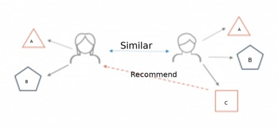
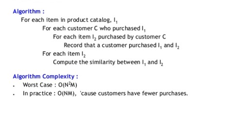
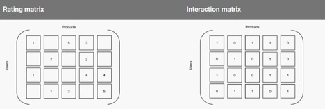
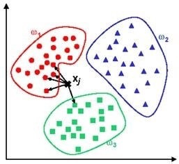
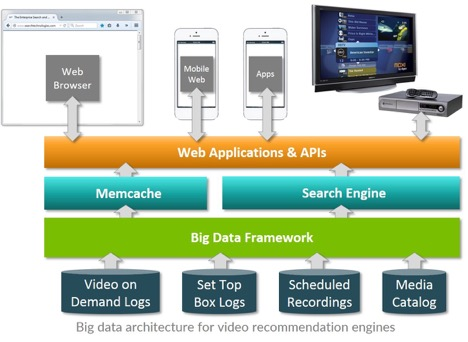

# Big Data Application in recommender systems :wave: :exclamation: fa18-523-70

| Sushmita Dash
| sushdash@iu.edu
| Indiana University
| hid: fa18-523-70
| github: [:cloud:](https://github.com/cloudmesh-community/fa18-523-70/blob/master/paper/paper.md)

---

Keywords: recommender system, TV genome, KNN classification

---
 
:o: image cations are missing

:o: proper citations with labels and refering to the labels in text missing. See the sampel in epub

:o: you have not verified that your paper shows up correct in epub otherwise you would see it

:o: i spend same time to at leas place your citation corerctly in the caption

## Introduction

In today’s world where people have a very busy lifestyle. They often do not have the time and patience to go through a very vast selection of options available to them. This is applicable in many aspects such as watching TV shows or getting a product online. Here is when our recommendation system comes into play. It plays a critical role in engaging the customers in the online service platforms.
Earlier, in order to find a movie or a product that the user likes, they had to tediously browse through media catalogs or product catalogs. Amidst information overload, shorter attention span, and competing content, the only way to grab users’ attention is personalization. This is where big data comes into play

There are many daily life examples where we can see the use of the recommender systems. Few examples are as follows:

1. Netflix uses this to show a personalized recommendation of the shows you may like based on the TV programs you have seen before
2. Various other tech giants also use this technology. For example, we often see friend suggestions in Facebook. It will be based on various criteria like how many mutual friends do we have. If we have been in any photo together or in the same school etc
3. We can see similar experience when we are browsing through a product catalog in Amazon or any other online shopping website. It will show us similar products based on our taste.

## What is a recommender system?

A recommendation engine filters the data using different algorithms and recommends the most relevant items to users. It first captures the past behavior of a customer and based on that, recommends products which the users might be likely to buy or watch [@fa18-523-70-TowardsDataScience].
Below is a very simple illustration of how recommender systems work in the context of an e-commerce site.

{#fig:fa18-523-70-TowardsDataScience}

Two users buy the same items A and B from an ecommerce store. When this happens the similarity index of these two users is computed. Depending on the score the system can recommend item C to the other user because it detects that those two users are similar in terms of the items they purchase[@fa18-523-70-datacamp].

## How does the recommender system work?

A typical recommendation engine processes data through the following four phases namely collection, storing, analyzing and filtering[@fa18-523-70-analyticsvidhya].

The phases are described below:

{#fig:fa18-523-70-TowardsDataScience}

1. Collection of Data

The first step in creating a recommendation engine is gathering data. Data can be either explicit or implicit data. Explicit data would consist of data inputted by users such as ratings and comments on products. And implicit data would be the order history/return history, Cart events, Pageviews, Click thru and search log. This data set will be created for every user visiting the site.

Behavior data is easy to collect because you can keep a log of user activities on your site. Collecting this data is also straightforward because it doesn’t need any extra action from the user; they’re already using the application. The downside of this approach is that it’s harder to analyze the data. For example, filtering the needful logs from the less needful ones can be difficult.

Since each user is bound to have different likes or dislikes about a product, their data sets will be distinct. Over time as you ‘feed’ the engine more data, it gets smarter and smarter with its recommendations so that your email subscribers and customers are more likely to engage, click and buy. Just like how the Amazon’s recommendation engine works with the ‘Frequently bought together’ and ‘Recommended for you’ tab.

2. Storing the data:

The more training data is available for the algorithms, better the recommendations will be. This means that any recommendations project can quickly turn into a big data project. The storage of the data depends on whether we are trying to capture user’s input or behavior and on factors such as ease of implementation, size of the data, integration with other systems and portability. We can use noSQL database or a standard SQL database, etc. for data storage. When saving user ratings or comments, a scalable and managed database minimizes the number of tasks required and helps to focus on the recommendation. Cloud SQL fulfills both of these needs and also makes it easy to load the data directly from Spark.

3. Analyzing the data:

In order to find items with similar user engagement data, data is filtered using different analysis methods. 
Some of the ways in which we can analyze the data are:

* Real-time systems can process data as it’s created. This type of system usually involves tools that can process and analyze streams of events. A real-time system would be required to give in-the-moment recommendations.

* Batch analysis demands you to process the data periodically. This approach implies that enough data needs to be created in order to make the analysis relevant, such as daily sales volume. A batch system might work fine to send an e-mail at a later date.

* Near-real-time analysis lets you gather data quickly so you can refresh the analytics every few minutes or seconds. A near-real-time system works best for providing recommendations during the same browsing session.

{#fig:fa18-523-70-TowardsDataScience}
 
4. Filtering the data:

After collecting and storing the data, we have to filter it so as to extract the relevant information required to make the final recommendations. We need to filter the data to get the relevant data necessary to provide recommendations to the user. We have to choose an algorithm that would better suit the recommendation engine. For example

* **Content-based**: A popular, recommended product has similar characteristics to what a user views or likes.

* **Cluster**: Recommended products go well together, no matter what other users have done.

* **Collaborative**: Other users, who like the same products as another user views or likes, will also like a recommended product.  Collaborative filtering enables you to make product attributes theoretical and make predictions based on user tastes. The output of this filtering is based on the assumption that two users who liked the same products in the past will probably like the same ones now or in the future.

Data about ratings or interactions can be represented as a set of matrices, with products and users as dimensions. Assume that the following two matrices are similar, but then we deduct the second from the first by replacing existing ratings with the number one and missing ratings by the number zero. The resulting matrix is a truth table where a number one represents an interaction by users with a product.

{#fig:fa18-523-70-TowardsDataScience}

We use K-Nearest algorithm, Jaccard’s coefficient, Dijkstra’s algorithm, cosine similarity to better relate the data sets of people for recommending based on the rating or product.

{#fig:fa18-523-70-TowardsDataScience}

The above graph shows how a k-nearest algorithm’s cluster filtering works.
Then finally, the result obtained after filtering and using the algorithm, recommendations are given to the user based on the timeliness of the type of recommendation. Whether real time recommendation or sending an email later after some time.

{#fig:fa18-523-70-datacamp}

## Types of recommender systems

Recommender systems are among the most popular applications of data science today[@fa18-523-70-GoogeCloud]. They are used to predict the "rating" or "preference" that a user would give to an item. Almost every major tech company has applied them in some form or the other: Amazon uses it to suggest products to customers, YouTube uses it to decide which video to play next on auto play, and Facebook uses it to recommend pages to like and people to follow. What's more, for some companies -think Netflix and Spotify-, the business model and its success revolves around the potency of their recommendations. In fact, Netflix even offered a million dollars in 2009 to anyone who could improve its system by 10%.

1.	**Simple recommenders**: offer generalized recommendations to every user, based on movie popularity and/or genre. The basic idea behind this system is that movies that are more popular and critically acclaimed will have a higher probability of being liked by the average audience. IMDB Top 250 is an example of this system.

2.	**Content-based recommenders**: suggest similar items based on a particular item. This system uses item metadata, such as genre, director, description, actors, etc. for movies, to make these recommendations. The general idea behind these recommender systems is that if a person liked a particular item, he or she will also like an item that is similar to it.

3.	**Collaborative filtering engines**: these systems try to predict the rating or preference that a user would give an item-based on past ratings and preferences of other users. Collaborative filters do not require item metadata like its content-based counterparts.

